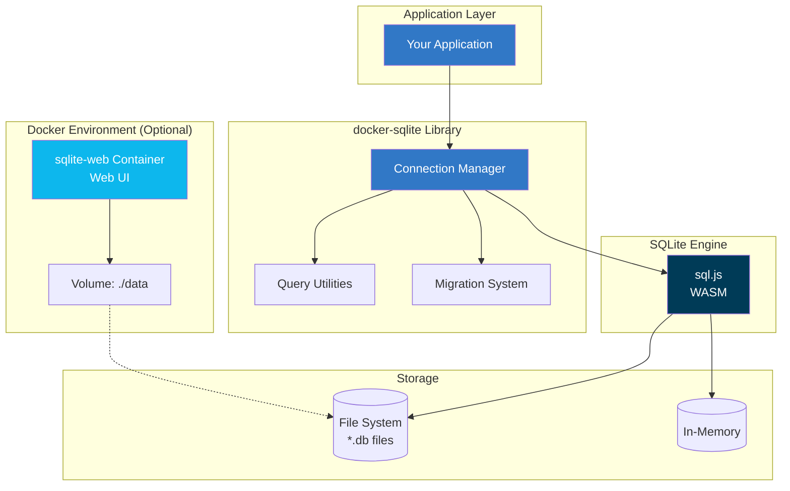
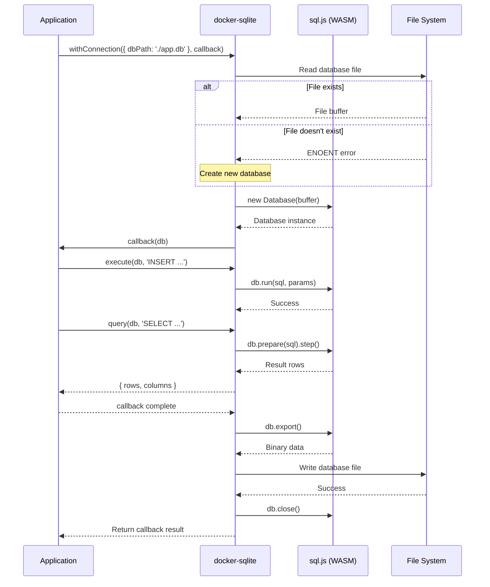

# @mark1russell7/docker-sqlite

[](https://www.npmjs.com/package/@mark1russell7/docker-sqlite)
[](https://opensource.org/licenses/MIT)
[](https://www.typescriptlang.org/)
[](https://nodejs.org/)

> Reusable SQLite setup with TypeScript utilities for connection management, queries, and migrations using sql.js (SQLite compiled to WASM).

## Overview

`@mark1russell7/docker-sqlite` provides a complete SQLite development environment with:

- **Portable SQLite via WASM** - Uses sql.js for cross-platform compatibility without native dependencies
- **Type-safe utilities** - Connection management, query execution, and migration system with full TypeScript support
- **Auto-save functionality** - Changes automatically persisted to file with managed connections
- **Migration system** - Version-controlled schema migrations with up/down support
- **Docker integration** - Optional web UI for database browsing via docker-compose
- **Zero native dependencies** - Works in Node.js, browsers, and edge environments

## Table of Contents

- [Architecture](#architecture)
- [Installation](#installation)
- [Docker Setup](#docker-setup)
- [TypeScript API](#typescript-api)
- [Migration System](#migration-system)
- [Configuration](#configuration)
- [Integration](#integration)
- [Examples](#examples)
- [API Reference](#api-reference)

## Architecture



### Library Architecture

```
┌─────────────────────────────────────────────────────────────┐
│  Application                                                │
│  ┌───────────────────────────────────────────────────────┐  │
│  │  await withConnection({ dbPath: './app.db' }, (db) => │  │
│  │    runMigrations(db, migrations);                     │  │
│  │    execute(db, 'INSERT INTO users ...');              │  │
│  │    const { rows } = query(db, 'SELECT * FROM users'); │  │
│  │  });                                                   │  │
│  └───────────────────────────────────────────────────────┘  │
└────────────────────────┬────────────────────────────────────┘
                         │
                         ▼
┌─────────────────────────────────────────────────────────────┐
│  @mark1russell7/docker-sqlite                               │
├─────────────────────────────────────────────────────────────┤
│                                                             │
│  ┌────────────────────────────────────────────────────┐    │
│  │  Connection (connect.ts)                           │    │
│  │  ┌──────────────────────────────────────────────┐  │    │
│  │  │  withConnection(config, callback)            │  │    │
│  │  │  ├─ Load db file (or create in-memory)      │  │    │
│  │  │  ├─ Execute callback with db instance       │  │    │
│  │  │  └─ Auto-save and close on completion       │  │    │
│  │  │                                              │  │    │
│  │  │  createConnection(config)                    │  │    │
│  │  │  └─ Manual connection management             │  │    │
│  │  └──────────────────────────────────────────────┘  │    │
│  └────────────────────────────────────────────────────┘    │
│                                                             │
│  ┌────────────────────────────────────────────────────┐    │
│  │  Query (query.ts)                                  │    │
│  │  ┌──────────────────────────────────────────────┐  │    │
│  │  │  query(db, sql, params?)                     │  │    │
│  │  │  └─ Execute SELECT, return {rows, columns}  │  │    │
│  │  │                                              │  │    │
│  │  │  execute(db, sql, params?)                   │  │    │
│  │  │  └─ Execute INSERT/UPDATE/DELETE            │  │    │
│  │  │                                              │  │    │
│  │  │  execMultiple(db, statements)                │  │    │
│  │  │  └─ Execute multiple statements              │  │    │
│  │  │                                              │  │    │
│  │  │  tableExists(db, tableName)                  │  │    │
│  │  │  lastInsertRowId(db)                         │  │    │
│  │  └──────────────────────────────────────────────┘  │    │
│  └────────────────────────────────────────────────────┘    │
│                                                             │
│  ┌────────────────────────────────────────────────────┐    │
│  │  Migration (migrate.ts)                            │    │
│  │  ┌──────────────────────────────────────────────┐  │    │
│  │  │  runMigrations(db, migrations)               │  │    │
│  │  │  └─ Apply pending migrations in order        │  │    │
│  │  │                                              │  │    │
│  │  │  rollbackMigration(db, migrations)           │  │    │
│  │  │  └─ Rollback last migration                  │  │    │
│  │  │                                              │  │    │
│  │  │  getMigrationStatus(db, migrations)          │  │    │
│  │  │  └─ Get current version and status           │  │    │
│  │  │                                              │  │    │
│  │  │  createMigration(...)                        │  │    │
│  │  │  └─ Helper to create migration objects       │  │    │
│  │  └──────────────────────────────────────────────┘  │    │
│  └────────────────────────────────────────────────────┘    │
│                                                             │
└────────────────────────┬────────────────────────────────────┘
                         │
                         ▼
                  ┌─────────────────┐
                  │    sql.js       │
                  │ (SQLite in WASM)│
                  └────────┬────────┘
                           │
                ┌──────────┴──────────┐
                ▼                     ▼
         ┌─────────────┐      ┌─────────────┐
         │ File System │      │  In-Memory  │
         │   *.db      │      │   Database  │
         └─────────────┘      └─────────────┘
```

### Data Flow Diagram



## Installation

```bash
npm install @mark1russell7/docker-sqlite
```

### Requirements

- **Node.js**: >= 20
- **Docker** (optional): For web UI to browse database
- **Docker Compose** (optional): For orchestration

## Docker Setup

The package includes an optional Docker Compose configuration that provides a web-based SQLite browser.

### Quick Start

```bash
# Start SQLite Web UI
docker compose up -d

# Open http://localhost:8080 to browse your database

# Stop container
docker compose down
```

### Environment Variables

Configure the SQLite web viewer using environment variables:

| Variable | Default | Description |
|----------|---------|-------------|
| `SQLITE_CONTAINER_NAME` | `sqlite-web` | Name of the Docker container |
| `SQLITE_PORT` | `8080` | Host port for web UI |
| `SQLITE_DB_PATH` | `./data` | Path to database directory on host |
| `SQLITE_DB_NAME` | `cli.db` | Database filename to open |

#### Example: Custom Configuration

Create a `.env` file:

```env
SQLITE_CONTAINER_NAME=myapp-sqlite-ui
SQLITE_PORT=8090
SQLITE_DB_PATH=./database
SQLITE_DB_NAME=myapp.db
```

Then run:

```bash
docker compose up -d
```

### Container Features

- **Web-based UI**: Browse and query SQLite databases via browser
- **Auto-restart**: Container restarts unless explicitly stopped
- **Volume mounting**: Live view of database changes
- **Health checks**: Monitors UI availability every 30s
- **Read-write mode**: Can modify database through UI

### Web UI Usage

Once running, navigate to `http://localhost:8080` to:

- Browse tables and schema
- Execute SQL queries
- View indexes and constraints
- Export data as CSV/JSON
- Modify records directly

## TypeScript API

### Connection Management

#### `withConnection<T>(config, callback): Promise<T>`

Execute a callback with an auto-managed SQLite connection. The database is automatically loaded, saved, and closed.

```typescript
import { withConnection, query, execute } from '@mark1russell7/docker-sqlite';

const users = await withConnection(
  { dbPath: './data/app.db' },
  (db) => {
    execute(db, 'INSERT INTO users (name) VALUES (?)', ['Alice']);
    return query(db, 'SELECT * FROM users');
  }
);

console.log(users.rows);
```

**Parameters:**
- `config.dbPath`: Path to database file (use `':memory:'` for in-memory database)
- `callback`: Function receiving `Database` instance

**Returns:** Result of the callback function

**Behavior:**
- Creates database file if it doesn't exist
- Automatically saves changes after callback completes
- Closes database connection in finally block
- Creates parent directories as needed

---

#### `createConnection(config): Promise<{db, save}>`

Create a manually-managed connection. Caller must handle saving and closing.

```typescript
import { createConnection, execute } from '@mark1russell7/docker-sqlite';

const { db, save } = await createConnection({ dbPath: './data/app.db' });

try {
  execute(db, 'INSERT INTO logs (message) VALUES (?)', ['Started']);
  await save(); // Explicitly save changes
} finally {
  db.close();
}
```

### Query Operations

#### `query<T>(db, sql, params?): QueryResult<T>`

Execute a SELECT query and return typed results.

```typescript
import { query } from '@mark1russell7/docker-sqlite';

interface User {
  id: number;
  name: string;
  email: string;
}

const result = query<User>(
  db,
  'SELECT * FROM users WHERE age > ?',
  [21]
);

console.log(result.columns); // ['id', 'name', 'email']
console.log(result.rows);    // Array of User objects
```

**Parameters:**
- `db`: Database instance
- `sql`: SQL SELECT statement
- `params?`: Optional parameter values

**Returns:**
```typescript
{
  columns: string[];  // Column names
  rows: T[];          // Result rows as typed objects
}
```

---

#### `execute(db, sql, params?): ExecuteResult`

Execute an INSERT, UPDATE, or DELETE statement.

```typescript
import { execute, lastInsertRowId } from '@mark1russell7/docker-sqlite';

const result = execute(
  db,
  'INSERT INTO users (name, email) VALUES (?, ?)',
  ['Bob', 'bob@example.com']
);

console.log(result.changes);     // 1
console.log(lastInsertRowId(db)); // New row ID
```

**Returns:**
```typescript
{
  changes: number;  // Number of rows affected
}
```

---

#### `execMultiple(db, sql): void`

Execute multiple SQL statements at once. Useful for schema setup and batch operations.

```typescript
import { execMultiple } from '@mark1russell7/docker-sqlite';

execMultiple(db, `
  CREATE TABLE IF NOT EXISTS users (
    id INTEGER PRIMARY KEY AUTOINCREMENT,
    name TEXT NOT NULL,
    email TEXT UNIQUE
  );

  CREATE INDEX IF NOT EXISTS idx_users_email ON users(email);

  CREATE TABLE IF NOT EXISTS posts (
    id INTEGER PRIMARY KEY,
    user_id INTEGER,
    title TEXT,
    FOREIGN KEY (user_id) REFERENCES users(id)
  );
`);
```

---

#### `tableExists(db, tableName): boolean`

Check if a table exists in the database.

```typescript
import { tableExists } from '@mark1russell7/docker-sqlite';

if (!tableExists(db, 'users')) {
  execute(db, 'CREATE TABLE users (id INTEGER PRIMARY KEY, name TEXT)');
}
```

---

#### `lastInsertRowId(db): number`

Get the row ID of the last inserted row.

```typescript
import { execute, lastInsertRowId } from '@mark1russell7/docker-sqlite';

execute(db, 'INSERT INTO users (name) VALUES (?)', ['Alice']);
const userId = lastInsertRowId(db);
console.log(`Created user with ID: ${userId}`);
```

## Migration System

The package includes a complete migration system for versioned schema management.

### Migration Structure

```typescript
interface Migration {
  version: number;        // Unique version number (sequential)
  description: string;    // Human-readable description
  up: string;            // SQL to apply migration
  down?: string;         // SQL to rollback migration (optional)
}
```

### `runMigrations(db, migrations): Migration[]`

Apply all pending migrations in order.

```typescript
import { withConnection, runMigrations } from '@mark1russell7/docker-sqlite';

const migrations = [
  {
    version: 1,
    description: 'Create users table',
    up: `
      CREATE TABLE users (
        id INTEGER PRIMARY KEY AUTOINCREMENT,
        name TEXT NOT NULL,
        email TEXT UNIQUE
      )
    `,
    down: 'DROP TABLE users'
  },
  {
    version: 2,
    description: 'Add created_at column',
    up: 'ALTER TABLE users ADD COLUMN created_at TEXT DEFAULT CURRENT_TIMESTAMP',
    down: 'ALTER TABLE users DROP COLUMN created_at'
  },
  {
    version: 3,
    description: 'Create posts table',
    up: `
      CREATE TABLE posts (
        id INTEGER PRIMARY KEY,
        user_id INTEGER,
        title TEXT NOT NULL,
        content TEXT,
        FOREIGN KEY (user_id) REFERENCES users(id)
      )
    `
  }
];

await withConnection({ dbPath: './data/app.db' }, (db) => {
  const applied = runMigrations(db, migrations);
  console.log(`Applied ${applied.length} migrations`);
  applied.forEach(m => console.log(`  ✓ ${m.description}`));
});
```

**Behavior:**
- Creates `_migrations` table automatically to track applied migrations
- Applies only pending migrations in version order
- Records each migration with timestamp
- Skips already-applied migrations
- Throws error if migration fails (doesn't continue)

**Returns:** Array of applied migrations

---

### `getMigrationStatus(db, migrations): MigrationStatus`

Get the current migration status.

```typescript
import { getMigrationStatus } from '@mark1russell7/docker-sqlite';

const status = getMigrationStatus(db, migrations);

console.log(`Current version: ${status.currentVersion}`);
console.log(`Applied migrations: ${status.appliedMigrations.join(', ')}`);
console.log(`Pending migrations: ${status.pendingMigrations.length}`);

status.pendingMigrations.forEach(m => {
  console.log(`  - v${m.version}: ${m.description}`);
});
```

**Returns:**
```typescript
{
  currentVersion: number;           // Latest applied version (0 if none)
  appliedMigrations: number[];      // Array of applied version numbers
  pendingMigrations: Migration[];   // Migrations not yet applied
}
```

---

### `rollbackMigration(db, migrations): Migration | null`

Rollback the last applied migration.

```typescript
import { rollbackMigration } from '@mark1russell7/docker-sqlite';

const rolled = rollbackMigration(db, migrations);

if (rolled) {
  console.log(`Rolled back: v${rolled.version} - ${rolled.description}`);
} else {
  console.log('No migrations to rollback');
}
```

**Requirements:**
- Migration must have a `down` script
- Migration must be the current version

**Returns:** The rolled-back migration, or `null` if none

---

### `createMigration(version, description, up, down?): Migration`

Helper function to create a migration object.

```typescript
import { createMigration } from '@mark1russell7/docker-sqlite';

const migration = createMigration(
  1,
  'Initial schema',
  'CREATE TABLE users (id INTEGER PRIMARY KEY)',
  'DROP TABLE users'
);
```

## Configuration

### Database Paths

```typescript
// In-memory database (no persistence)
await withConnection({ dbPath: ':memory:' }, (db) => {
  // Data is lost after connection closes
});

// Relative path
await withConnection({ dbPath: './data/app.db' }, (db) => {
  // Saved to ./data/app.db
});

// Absolute path
await withConnection({ dbPath: '/var/lib/myapp/app.db' }, (db) => {
  // Saved to /var/lib/myapp/app.db
});

// Default (in-memory)
await withConnection({}, (db) => {
  // No persistence
});
```

### Common Patterns

#### CLI Logging Database

The package includes a reference schema for CLI logging in `schema/logs.sql`:

```typescript
import { withConnection, execMultiple } from '@mark1russell7/docker-sqlite';
import { readFile } from 'node:fs/promises';

const schema = await readFile('./node_modules/@mark1russell7/docker-sqlite/schema/logs.sql', 'utf-8');

await withConnection({ dbPath: './cli-logs.db' }, (db) => {
  execMultiple(db, schema);

  execute(db, `
    INSERT INTO logs (level, message, command, session_id)
    VALUES (?, ?, ?, ?)
  `, ['info', 'Command started', 'lib.refresh', sessionId]);
});
```

#### Testing Pattern

```typescript
import { describe, it } from 'node:test';
import assert from 'node:assert';
import { withConnection, query, execute } from '@mark1russell7/docker-sqlite';

describe('User repository', () => {
  it('should create and retrieve user', async () => {
    await withConnection({ dbPath: ':memory:' }, (db) => {
      // Setup schema
      execute(db, 'CREATE TABLE users (id INTEGER PRIMARY KEY, name TEXT)');

      // Test
      execute(db, 'INSERT INTO users (name) VALUES (?)', ['Alice']);
      const result = query(db, 'SELECT * FROM users WHERE name = ?', ['Alice']);

      assert.strictEqual(result.rows.length, 1);
      assert.strictEqual(result.rows[0].name, 'Alice');
    });
  });
});
```

#### Migration-based Setup

```typescript
import { withConnection, runMigrations, getMigrationStatus } from '@mark1russell7/docker-sqlite';

const migrations = [
  {
    version: 1,
    description: 'Initial schema',
    up: `
      CREATE TABLE users (id INTEGER PRIMARY KEY, name TEXT);
      CREATE TABLE posts (id INTEGER PRIMARY KEY, user_id INTEGER);
    `
  }
];

async function initDatabase(dbPath: string) {
  await withConnection({ dbPath }, (db) => {
    const status = getMigrationStatus(db, migrations);

    if (status.pendingMigrations.length > 0) {
      console.log(`Applying ${status.pendingMigrations.length} migration(s)...`);
      runMigrations(db, migrations);
      console.log('Database up to date!');
    } else {
      console.log(`Database already at version ${status.currentVersion}`);
    }
  });
}

await initDatabase('./data/app.db');
```

## Integration

### Environment Configuration

Create a `.env` file for your application:

```env
# SQLite database path
SQLITE_DB_PATH=./data/app.db

# Docker Web UI settings (optional)
SQLITE_CONTAINER_NAME=myapp-sqlite-ui
SQLITE_PORT=8080
```

Load in your application:

```typescript
import 'dotenv/config';
import { withConnection } from '@mark1russell7/docker-sqlite';

const dbPath = process.env.SQLITE_DB_PATH || './app.db';

await withConnection({ dbPath }, (db) => {
  // Your database operations
});
```

### npm Scripts

Add to your `package.json`:

```json
{
  "scripts": {
    "db:ui": "docker compose -f node_modules/@mark1russell7/docker-sqlite/docker-compose.yml up -d",
    "db:ui:stop": "docker compose -f node_modules/@mark1russell7/docker-sqlite/docker-compose.yml down",
    "db:migrate": "tsx scripts/migrate.ts",
    "db:rollback": "tsx scripts/rollback.ts"
  }
}
```

### Ecosystem Integration

This package integrates with the broader Mark Russell ecosystem:

- **@mark1russell7/cue**: TypeScript configuration inheritance
- **client-sqlite**: MCP client procedures for SQLite operations
- **bundle-dev**: Development bundle including database tooling

## Examples

### Complete Application with Migrations

```typescript
import { withConnection, runMigrations, query, execute } from '@mark1russell7/docker-sqlite';

// Define schema migrations
const migrations = [
  {
    version: 1,
    description: 'Create users table',
    up: `
      CREATE TABLE users (
        id INTEGER PRIMARY KEY AUTOINCREMENT,
        username TEXT UNIQUE NOT NULL,
        email TEXT UNIQUE NOT NULL,
        created_at TEXT DEFAULT CURRENT_TIMESTAMP
      );
      CREATE INDEX idx_users_email ON users(email);
    `,
    down: 'DROP TABLE users'
  },
  {
    version: 2,
    description: 'Create posts table',
    up: `
      CREATE TABLE posts (
        id INTEGER PRIMARY KEY AUTOINCREMENT,
        user_id INTEGER NOT NULL,
        title TEXT NOT NULL,
        content TEXT,
        created_at TEXT DEFAULT CURRENT_TIMESTAMP,
        FOREIGN KEY (user_id) REFERENCES users(id) ON DELETE CASCADE
      );
      CREATE INDEX idx_posts_user ON posts(user_id);
    `,
    down: 'DROP TABLE posts'
  }
];

// Application setup
async function setupDatabase(dbPath: string) {
  await withConnection({ dbPath }, (db) => {
    // Apply migrations
    const applied = runMigrations(db, migrations);
    if (applied.length > 0) {
      console.log(`Applied ${applied.length} migration(s)`);
    }
  });
}

// User operations
interface User {
  id: number;
  username: string;
  email: string;
  created_at: string;
}

async function createUser(dbPath: string, username: string, email: string): Promise<number> {
  return withConnection({ dbPath }, (db) => {
    execute(db, 'INSERT INTO users (username, email) VALUES (?, ?)', [username, email]);
    return lastInsertRowId(db);
  });
}

async function getUsers(dbPath: string): Promise<User[]> {
  return withConnection({ dbPath }, (db) => {
    const result = query<User>(db, 'SELECT * FROM users ORDER BY created_at DESC');
    return result.rows;
  });
}

// Usage
const dbPath = './data/myapp.db';

await setupDatabase(dbPath);
const userId = await createUser(dbPath, 'alice', 'alice@example.com');
const users = await getUsers(dbPath);

console.log(`Created user ID: ${userId}`);
console.log(`Total users: ${users.length}`);
```

### Transaction Pattern (Manual Connection)

```typescript
import { createConnection, execute } from '@mark1russell7/docker-sqlite';

async function transferCredits(fromUserId: number, toUserId: number, amount: number) {
  const { db, save } = await createConnection({ dbPath: './data/app.db' });

  try {
    // Start transaction
    execute(db, 'BEGIN TRANSACTION');

    // Deduct from sender
    execute(db, 'UPDATE users SET credits = credits - ? WHERE id = ?', [amount, fromUserId]);

    // Check sender balance
    const result = query(db, 'SELECT credits FROM users WHERE id = ?', [fromUserId]);
    if (result.rows[0].credits < 0) {
      throw new Error('Insufficient credits');
    }

    // Add to receiver
    execute(db, 'UPDATE users SET credits = credits + ? WHERE id = ?', [amount, toUserId]);

    // Commit
    execute(db, 'COMMIT');
    await save();

    console.log(`Transferred ${amount} credits from user ${fromUserId} to ${toUserId}`);
  } catch (error) {
    // Rollback on error
    execute(db, 'ROLLBACK');
    throw error;
  } finally {
    db.close();
  }
}
```

### Query Builder Pattern

```typescript
import { withConnection, query } from '@mark1russell7/docker-sqlite';

interface QueryBuilder {
  select(columns: string[]): this;
  from(table: string): this;
  where(condition: string, params: unknown[]): this;
  orderBy(column: string, direction?: 'ASC' | 'DESC'): this;
  limit(limit: number): this;
  execute<T>(): QueryResult<T>;
}

class SQLiteQueryBuilder implements QueryBuilder {
  private parts: {
    select: string[];
    from: string;
    where: { condition: string; params: unknown[] }[];
    orderBy?: string;
    limit?: number;
  } = { select: ['*'], from: '', where: [] };

  constructor(private db: Database) {}

  select(columns: string[]): this {
    this.parts.select = columns;
    return this;
  }

  from(table: string): this {
    this.parts.from = table;
    return this;
  }

  where(condition: string, params: unknown[]): this {
    this.parts.where.push({ condition, params });
    return this;
  }

  orderBy(column: string, direction: 'ASC' | 'DESC' = 'ASC'): this {
    this.parts.orderBy = `${column} ${direction}`;
    return this;
  }

  limit(limit: number): this {
    this.parts.limit = limit;
    return this;
  }

  execute<T>(): QueryResult<T> {
    let sql = `SELECT ${this.parts.select.join(', ')} FROM ${this.parts.from}`;
    const params: unknown[] = [];

    if (this.parts.where.length > 0) {
      sql += ' WHERE ' + this.parts.where.map(w => w.condition).join(' AND ');
      this.parts.where.forEach(w => params.push(...w.params));
    }

    if (this.parts.orderBy) {
      sql += ` ORDER BY ${this.parts.orderBy}`;
    }

    if (this.parts.limit) {
      sql += ` LIMIT ${this.parts.limit}`;
    }

    return query<T>(this.db, sql, params);
  }
}

// Usage
await withConnection({ dbPath: './data/app.db' }, (db) => {
  const builder = new SQLiteQueryBuilder(db);

  const result = builder
    .select(['id', 'username', 'email'])
    .from('users')
    .where('created_at > ?', ['2024-01-01'])
    .where('email LIKE ?', ['%@example.com'])
    .orderBy('created_at', 'DESC')
    .limit(10)
    .execute<User>();

  console.log(result.rows);
});
```

## API Reference

### Types

```typescript
interface ConnectionConfig {
  dbPath: string;  // Path to database file, or ':memory:' for in-memory
}

type ConnectionCallback<T> = (db: Database) => T | Promise<T>;

interface QueryResult<T = Record<string, unknown>> {
  columns: string[];  // Column names
  rows: T[];          // Result rows as typed objects
}

interface ExecuteResult {
  changes: number;  // Number of rows affected
}

interface Migration {
  version: number;        // Unique version number (sequential)
  description: string;    // Human-readable description
  up: string;            // SQL to apply migration
  down?: string;         // SQL to rollback migration (optional)
}

interface MigrationStatus {
  currentVersion: number;           // Latest applied version (0 if none)
  appliedMigrations: number[];      // Array of applied version numbers
  pendingMigrations: Migration[];   // Migrations not yet applied
}
```

### Functions

All functions are fully documented with JSDoc and include TypeScript type definitions. Import from the package root:

```typescript
import {
  // Connection
  withConnection,
  createConnection,

  // Query
  query,
  execute,
  execMultiple,
  tableExists,
  lastInsertRowId,

  // Migration
  runMigrations,
  rollbackMigration,
  getMigrationStatus,
  createMigration,

  // Types
  type ConnectionConfig,
  type QueryResult,
  type Migration,
  type MigrationStatus,
  type Database,
  // ... etc
} from '@mark1russell7/docker-sqlite';
```

## License

MIT

## Contributing

Issues and pull requests are welcome at the package repository.

## Related Packages

- [@mark1russell7/docker-mongo](../mongo) - MongoDB Docker setup with similar API
- [@mark1russell7/cue](https://github.com/mark1russell7/cue) - Shared TypeScript configuration
- [sql.js](https://github.com/sql-js/sql.js) - SQLite compiled to JavaScript/WASM
